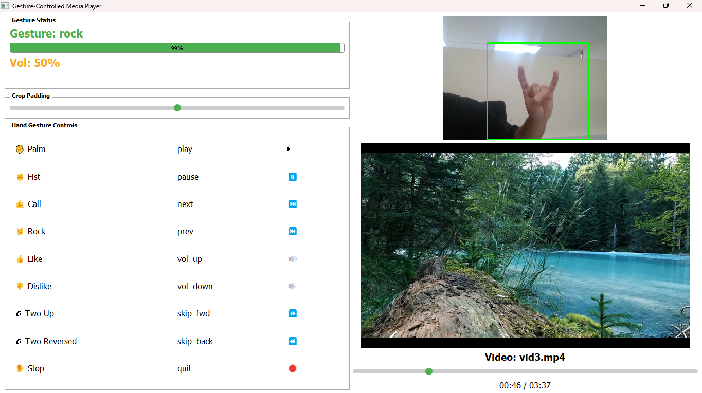

# Gesture-Controlled Media Player using MediaPipe & MobileNetV3
Estimate hand gestures in real-time using MediaPipe and recognize them with a MobileNetV3 model to control a media player application via webcam.

---

## Contents
This repository contains:
- Gesture-controlled media player application (PyQt5 GUI)
- Real-time webcam hand gesture prediction using MediaPipe
- MobileNetV3 fine-tuned gesture classification model
- Demo videos and gesture-action mapping
- Icons for visual action feedback

---

## Requirements
- Python 3.8+
- TensorFlow 2.11+
- OpenCV 4.5+
- MediaPipe 0.9+
- PyQt5
- VLC Python bindings (`python-vlc`)

Install dependencies:
```bash
pip install -r requirements.txt
```

---

## Demo
To launch the gesture-controlled media player with webcam input:
```bash
python app.py
```

Ensure that you have `.mp4` videos inside the `videos/` directory. If no videos are found, the app will exit with an error.

---

## Gesture to Action Mapping
The following table lists the recognized gestures and their corresponding media commands:

| Gesture            | Action          | Emoji |
|--------------------|------------------|--------|
| Palm               | Play             | ▶️     |
| Fist               | Pause            | ⏸️     |
| Call               | Next Video       | ⏭️     |
| Rock               | Previous Video   | ⏮️     |
| Like               | Volume Up        | 🔊     |
| Dislike            | Volume Down      | 🔉     |
| Two Up             | Skip Forward     | ⏩     |
| Two Reversed       | Skip Backward    | ⏪     |
| Stop               | Quit App         | 🛑     |

---

## Directory Structure
<pre>
│  app.py
│  model/
│      mobilenetv3_hagrid_finetuned.keras
│      gesture_classifier.tflite
│      gesture_labels.csv
│  videos/
│  scripts/
│      fromKeras_to_tflite.py
│      generate_crops.py
│      install_dataset.py
│  notebooks/
│      HaGRID_mobilenetv3_2.ipynb


</pre>

---

## How it Works
1. **Hand Detection**: Uses MediaPipe Hands to detect hand landmarks in the webcam frame.
2. **Cropping & Preprocessing**: Extracts and pads the hand region, then resizes and normalizes the image for MobileNetV3.
3. **Gesture Prediction**: Predicts gesture label using the Keras MobileNetV3 model.
4. **Command Execution**: Maps gesture to media control command (play, pause, volume, etc.) and sends it to VLC.
5. **UI Feedback**: Displays gesture label, confidence, and corresponding action icon in a PyQt5 GUI.

---

## Model Training (External)
This application uses a MobileNetV3 model fine-tuned on a subset of the HaGRID gesture dataset.
For training instructions, see the companion notebook:
- [`notebooks/HaGRID_mobilenetv3_2.ipynb`](notebooks/HaGRID_mobilenetv3_2.ipynb) 

---

## Screenshots


---

## License
This project is licensed under the MIT License.

---

## Credits
- Gesture detection powered by [MediaPipe Hands](https://google.github.io/mediapipe/solutions/hands.html)
- Model architecture: [MobileNetV3-Small](https://arxiv.org/abs/1905.02244)
- Dataset used for fine-tuning: [HaGRID Dataset](https://paperswithcode.com/dataset/hagrid)
- VLC integration via [python-vlc](https://pypi.org/project/python-vlc/)

---

## Author
**Ali Ramadan**  

